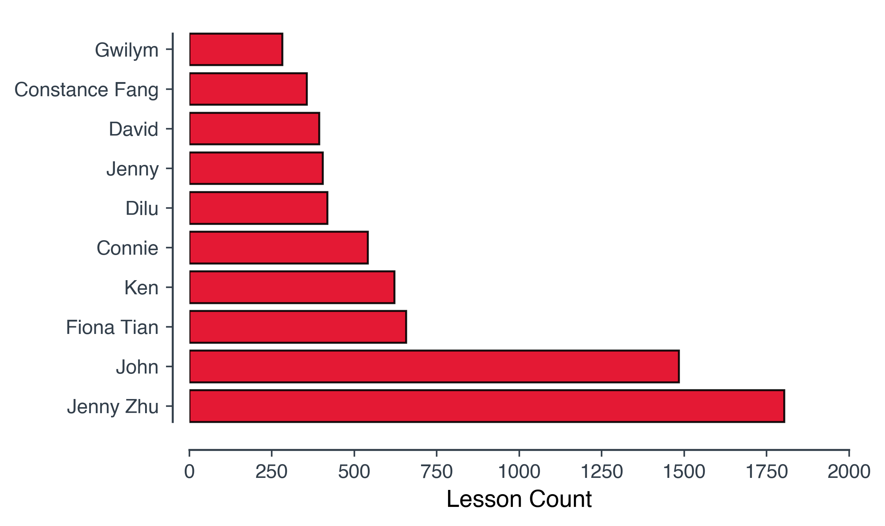

# ChinesePod Web Scraping Project

This is my first web scraping project, so I wanted to pick a website and data that really interested me. My choice was [ChinesePod](https://chinesepod.com/). I chose this as a project because I have been studying Chinese (普通话）for over a year and I am interested in subscribing to their service. I have watched many of their freely available videos on [Youtube](https://www.youtube.com/channel/UCRY8eBLd9tPFw5-JY7S7O8Q) and their material appears to be of very high quality. The reason I am considering subscribing to their service is that I think it may help improve my listening skills and extend my vocabulary.

The aim of this project is to learn the basics of web scraping such as using  BeautifulSoup and Selenium. This project will also demonstrate how to deal with logins and dynamic pages.

In the first part of this project, data will be scraped from the ChinesePod website related to their lessons.

The second part explores, cleans and visualises the scraped data in a separate jupyter notebook using pandas and Matplotlib. It is here we will find the answers to a few of our questions, e.g.,

- How many of levels are there and how many lessons in each level?
- What are their names?
- How many lessons for each level.
- How many video lessons?
- How many audio only lessons?
- How many different teachers are there?
- How often do they produce lessons?
- How long have they been making lessons?
- They haven't always made video lessons, how long have they been doing this?
- What are the most common topics covered in the lessons?
- and so on ....

The third part of this project is concerned with obtaining lesson materials from the site and processing the materials into a usable form.

## Scraping Data from ChinesePod

The actual scraping of data from the ChinesePod website is performed in
[ChinesePod_Explore.ipynb](ChinesePod_Explore.ipynb). This jupyter notebook is an implementation of a simple web scraper designed to scrape the details of the lessons available on the ChinesePod website. This notebook does not download the lesson notes, mp3 files or other materials. The purpose of this notebook is for me to become familiar with web scraping and how to wrangle the data into a usable format.

## Exploration of Scraped Data

The exploration of the scraped ChinesePod data is performed in
[ChinesePod_Explore.ipynb](ChinesePod_Explore.ipynb). This jupyter notebook will read in the data scraped from the ChinesePod website using the notebook [ChinesePod.ipynb](ChinesePod.ipynb). In this notebook we will simply answer a few basic questions we have about ChinesePod and visualise the data.

### Questions

- **How many lessons in total?** 4305

- **How many levels?** 7 levels plus 'Other'

- **What are they?**
  - Newbie
  - Elementary
  - Pre Intermediate
  - Intermediate
  - Upper Intermediate
  - Advanced
  - Media
  - Other (No clear level)

- **How many lessons in each level?**

  

- **How many with video?** 353

- **How many with audio only** 3952

- **How many teachers?** 108

- **Who are the 10 teachers that appeared in the most lessons?**

  

- **What a the top 10 most common lesson tags?**

  

- **Word cloud of tags**

  

- **How many years have they been producing lessons?** Nearly 15 years

- **When did they start?** 2005-05-19

- **What was the first lesson?** 'Welcome to ChinesePod'

- **When was the first video lesson produced?** 2008-09-01

- **What was it?** 'Traffic'

- **Most recent lesson in this dataset?** 'Five ways of seeing: 看、见、看见、看到、看出'

- **When was the most recent lesson released?** 2020-01-10

- **How many lessons per month?**

  

- **How many lessons per level per month?**

  

- **How many 'Newbie' video and audio lessons per month?**

  

- **How many video and audio lessons per month?**

  

## Automated Download of Lesson Materials

ChinesePod allows you to download various lesson materials such as MP3 files. However, it can be rather annoying to download all the files for
a particular lesson manually. The downloading of lesson materials from the ChinesePod website is performed in
[ChinesePod_Lesson_Downloader.ipynb](ChinesePod_Lesson_Downloader.ipynb). If you have a subscription to their service, this notebook can be used to automate the downloading of lesson materials. If a video of the lesson is available it is possible to download this too, but since video files are considerably larger than the audio files I have refrained from providing that feature in this notebook. This jupyter notebook will however:

- download available MP3 files related to the lesson

- create CSV files in [Anki](https://apps.ankiweb.net/) format containing the lesson dialogue, vocabulary, expansion and grammar sections  

- create a summary of the lesson in markdown format which can be easily converted to PDF (e.g., by using [Atom](https://atom.io/) with the package markdown-pdf or [Pandoc](https://pandoc.org/))

### Notes:

- To perform the web scraping I have used

  - Selenium with the Chrome browser,
  - BeautifulSoup,
  - and re for regular expressions.

- These notebooks require a subscription to ChinesePod in order to login.

- Pandas and Matplotlib was used for exploring and visualising the ChinesePod dataset.

- *wget* is used to download mp3 files
